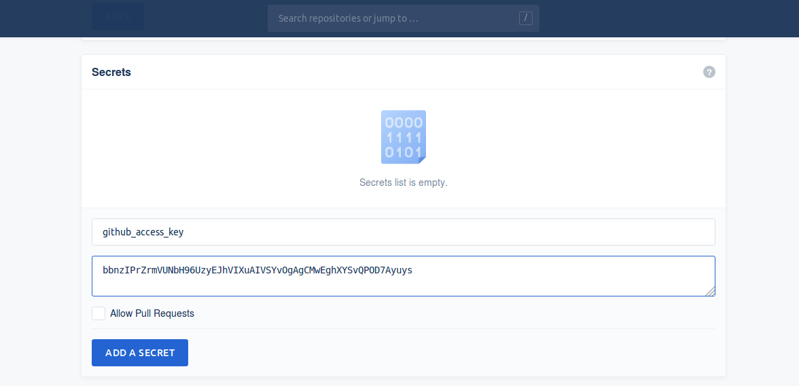

# Amethyst Drone CI Config Template

This is a starter template for the [Drone CI](https://drone.io) server that can be used to automatically build [Amethyst](https://github.com/amethyst/amethyst) games for 64bit Windows, Mac, and Linux *and* automatically deploy the builds to your GitHub releases.

Drone is a [Docker](https://docker.com) based CI server that is hosted free for Open Source projects. This makes it easy to provide free automated builds of your Amethyst project for anybody who might want to try it out!

## Usage

To use this for your project, first login to the [Drone Cloud](https://cloud.drone.io/) with your GitHub account. After logging in you will be able to see a list of the repositories that you own. Click on the repo that you want to setup and then click "Activate".

Next we need to create an access key that Drone can use to publish GitHub releases with. Follow the instructions [here](https://help.github.com/en/articles/creating-a-personal-access-token-for-the-command-line) to create a personal access token. Once you have created the token, you must add it Drone from the settings page in the Drone cloud:



After that is done, simply copy the [`template.drone.yml`](https://github.com/zicklag/amethyst-drone-config/blob/master/.drone.yml) from this repo to `.drone.yml` in your repo and replace all occurrences of `??CRATE_NAME??` with the name of your crate. Push the changes to your repo or open a PR, and Drone will detect it and run the builds.

### Releasing

Drone will automatically deploy to GitHub releases whenever you push a new annotated tag that starts with `v`. For example:

```bash
# The -a makes it an annotated tag
git tag -a v1.0.2 && git push --tags
```

This will create a new 1.0.2 release on GitHub that Drone will add your Windows, Mac, and Linux builds to so that users can download them.

## Example

This repo contains the default Amethyst game example and demonstrates successfully using this Drone config.
